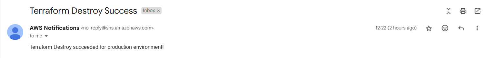

# S3 Backup Automation with Terraform and GitHub Actions

This project automates the backup process for Amazon S3 buckets using **Terraform** and integrates **GitHub Actions** for CI/CD. The setup includes a combination of **AWS Backup**, **EventBridge**, **SNS**, and **IAM** to create a reliable, event-driven backup system with notification capabilities.

---

## Project Features
1. **Infrastructure as Code (IaC)**: Uses Terraform to manage and deploy AWS resources.
2. **Backup Automation**: Implements automated backups for S3 buckets using AWS Backup service.
3. **Event-Driven Architecture**: Utilizes EventBridge to trigger workflows upon backup completion.
4. **Notifications**: Sends success notifications via SNS to subscribed email addresses.
5. **GitHub Actions Integration**: Automates Terraform execution and notifies users about the workflow's success or failure.

---

## Architecture Overview

**Components**:
- **GitHub Actions**: Automates Terraform `plan`, `apply`, and `destroy` commands.
- **Terraform Modules**:
  - `backup`: Manages S3 bucket backup configuration.
  - `sns`: Creates SNS topics and subscriptions for notifications.
  - `eventbridge`: Configures EventBridge rules to handle events.
- **AWS Services**:
  - **S3**: Target for backups.
  - **Backup**: Automates backup creation.
  - **EventBridge**: Triggers actions upon backup completion.
  - **SNS**: Notifies administrators about backup status.

---

## Repository Structure

```
├── main.tf                # Root Terraform configuration
├── variables.tf           # Input variables for the Terraform project
├── outputs.tf             # Outputs of the Terraform project
├── modules/
│   ├── sns/
│   │   ├── main.tf        # SNS topic and subscription setup
│   │   ├── variables.tf
│   │   ├── outputs.tf
│   ├── backup/
│   │   ├── main.tf        # Backup policies and IAM roles
│   │   ├── variables.tf
│   │   ├── outputs.tf
│   ├── eventbridge/
│       ├── main.tf        # EventBridge rules and targets
│       ├── variables.tf
│       ├── outputs.tf
└── .github/workflows/
    └── terraform.yml      # GitHub Actions workflow file
```

---

## Terraform Workflow
1. **Initialize Terraform**:
   ```bash
   terraform init
   ```
2. **Plan Infrastructure**:
   ```bash
   terraform plan -out=plan-<environment>.tfplan
   ```
3. **Apply Changes**:
   ```bash
   terraform apply -auto-approve plan-<environment>.tfplan
   ```
4. **Destroy Infrastructure**:
   ```bash
   terraform destroy -auto-approve
   ```

---

## GitHub Actions Workflow

The **GitHub Actions** workflow automates Terraform execution and sends notifications for the following actions:
- **Apply**: Deploys the infrastructure.
- **Destroy**: Removes the infrastructure.

### Workflow Configuration
File: `.github/workflows/terraform.yml`

---

## How to Run the Project

1. **Clone the Repository**:
   ```bash
   git clone <repository_url>
   cd <repository_name>
   ```

2. **Set Up GitHub Secrets**:
   - `AWS_ACCESS_KEY_ID`: Your AWS Access Key ID.
   - `AWS_SECRET_ACCESS_KEY`: Your AWS Secret Access Key.
   - `SNS_TOPIC_ARN`: ARN of the SNS topic for notifications.

3. **Trigger the Workflow**:
   - Go to **Actions** tab in GitHub.
   - Select the workflow and input the required parameters:
     - `action`: `Terraform_apply` or `Terraform_destroy`.
     - `environment`: `staging` or `production`.

---
## Example Terraform Execution Output

```plaintext
Run terraform apply -auto-approve plan-production.tfplan
module.eventbridge.aws_cloudwatch_event_rule.backup_event_rule: Creating...
module.backup.aws_iam_role.backup_role: Creating...
module.backup.aws_backup_vault.backup_vault: Creating...
module.sns.aws_sns_topic.sns_topic: Creating...
module.backup.aws_backup_vault.backup_vault: Creation complete after 1s [id=s3-backup-vault]
module.backup.aws_backup_plan.backup_plan: Creating...
module.eventbridge.aws_cloudwatch_event_rule.backup_event_rule: Creation complete after 1s [id=backup-completion-event]
module.backup.aws_iam_role.backup_role: Creation complete after 1s [id=backup-service-role]
module.backup.aws_iam_role_policy_attachment.backup_policy_attachment: Creating...
module.backup.aws_backup_plan.backup_plan: Creation complete after 1s [id=47411bf8-725e-4e6f-b6cc-bc096b934f3e]
module.backup.aws_backup_selection.backup_selection: Creating...
module.sns.aws_sns_topic.sns_topic: Creation complete after 2s [id=arn:aws:sns:***:239273560241:s3-backup-notifications]
module.sns.aws_sns_topic_subscription.sns_email_subscription: Creating...
module.eventbridge.aws_cloudwatch_event_target.backup_event_target: Creating...
module.eventbridge.aws_cloudwatch_event_target.backup_event_target: Creation complete after 1s [id=backup-completion-event-terraform-20241129063557250600000002]
module.sns.aws_sns_topic_subscription.sns_email_subscription: Creation complete after 1s [id=arn:aws:sns:***:239273560241:s3-backup-notifications:e3754d64-75d8-4e4a-b54a-5cc1ad4c1b94]
module.backup.aws_backup_selection.backup_selection: Creation complete after 4s [id=41e9b935-0bd9-4f9a-9e10-572dce7ff4a1]
```
---

## Notes  

⚠️ **Important Reminder**:  
"Because we all love the thrill of an unexpected AWS bill, don't forget to *not* destroy your infrastructure after testing. Who doesn't enjoy explaining a hefty cloud bill to their manager? But hey, if you're into that sort of thing, go ahead and leave it running. 😉"  

🔥 *Pro Tip*: Save yourself the trouble—follow the steps under [**Trigger the Workflow**](#trigger-the-workflow) in the **How to Run the Project** section to trigger the `Terraform_destroy` workflow. Your wallet will thank you later!  

---

## Screeshots of Execution  

Below are the screenshots showcasing the successful execution of this project, from applying the infrastructure to completing the backup process and finally destroying the resources.  

### 1. Terraform Apply Success  
  

### 2. Backup Process Completed  
  

### 3. Terraform Destroy Success  
  

These images are a testament to the seamless implementation and teardown of this backup solution. 🎉 

---

## License
This project is licensed under the MIT License. See the LICENSE file for details.

--- 
